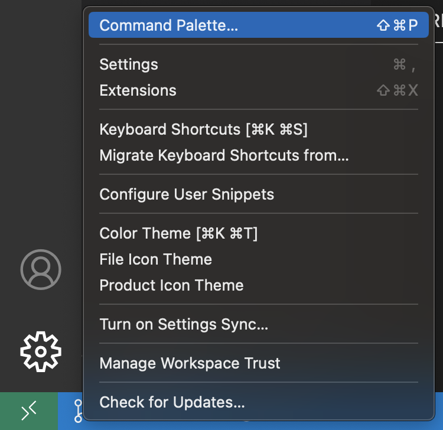
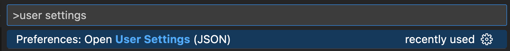
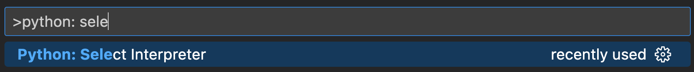
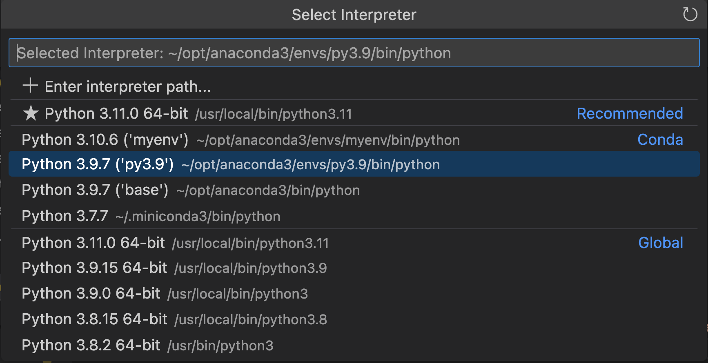

Usually I work with a local Anaconda installation and create virtual envs for different projects. Usually Visual Studio Code finds the installed environments and lists them. If the preferred base anaconda installation is not shown in Visual Studio Code it is best to configure it using the user level settings as follows:

1. Open the command palette by clicking on the gear in the bottom left and choose "Command Palette..." (or by using a keyboard shortcut):
   

2. Search and select the entry "Open User Settings (JSON)"
   

3. Add the option to set the conda path:

   ```"python.condaPath": "/Users/aboettcher/opt/anaconda3/bin/conda"```

4. Open again the command palette (Step 1) and search and select for "Pyton: select interpreter"

   

5. Select python environment:
   


Source: [Medium](https://medium.com/analytics-vidhya/efficient-way-to-activate-conda-in-vscode-ef21c4c231f2)
